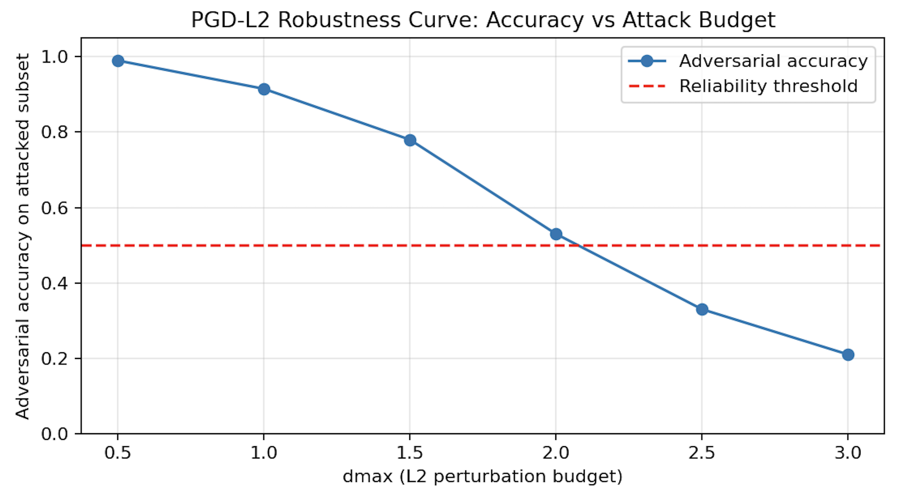
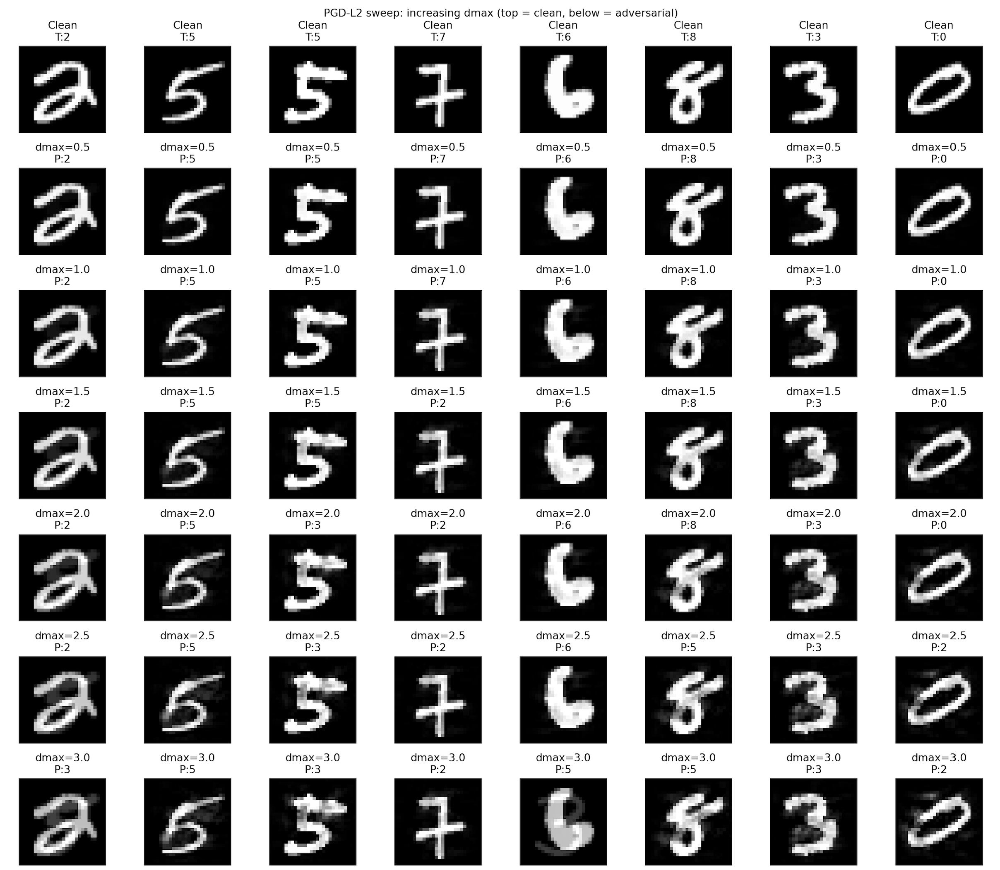
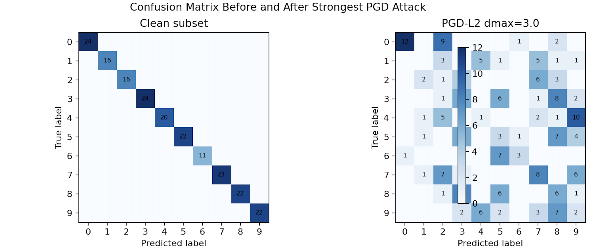
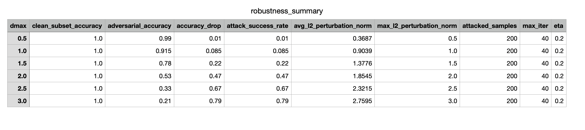
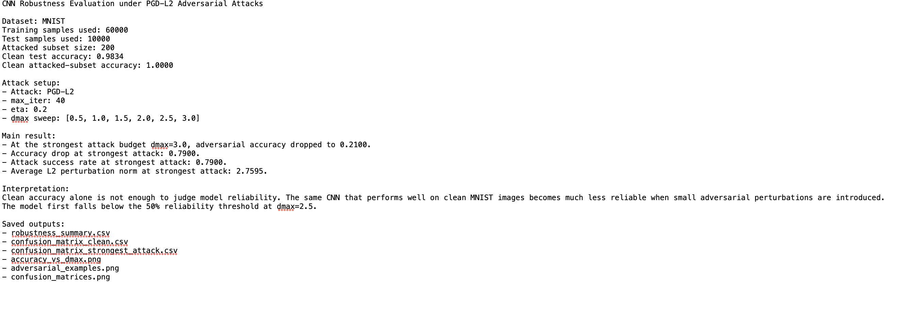

# CNN Robustness Check with PGD Adversarial Attacks

I built this project to understand how a CNN model behaves when the input images are slightly changed in a way that is designed to fool the model. The model performs well on clean MNIST digits, but the main question I wanted to test was: **does clean accuracy still tell the full story when adversarial perturbations are introduced?**

The project trains a simple CNN on MNIST and then evaluates it using a PGD-L2 adversarial attack. I sweep the attack budget `dmax` from small to stronger perturbations and measure how quickly the model accuracy drops. I kept the project focused on evaluation rather than making it a large security project.

## What This Project Does

- Trains a CNN classifier on MNIST.
- Evaluates clean test accuracy.
- Selects correctly classified test samples for attack.
- Runs PGD-L2 adversarial attacks with increasing `dmax` values.
- Measures adversarial accuracy and attack success rate.
- Calculates average and maximum L2 perturbation norms.
- Saves clean and adversarial confusion matrices.
- Saves a robustness summary CSV and a short text report.
- Generates visual outputs for the accuracy curve and adversarial examples.

## Why I Worked on This

In many basic deep learning projects, the model is only judged using clean accuracy. This project helped me understand why that is not enough. A model can look strong on normal test data but still be vulnerable when the input is modified by an adversarial attack.

I kept MNIST because it is a clean and understandable dataset for learning adversarial robustness. The focus of this project is not dataset complexity, but the evaluation workflow: attack setup, perturbation budget, accuracy drop, confusion matrices, and interpretation.

## Attack Setup

- Dataset: MNIST
- Model: Simple CNN
- Attack: PGD-L2
- Attack subset: 200 correctly classified test images
- Attack budget sweep: `dmax = [0.5, 1.0, 1.5, 2.0, 2.5, 3.0]`
- PGD iterations: 40
- Step size: 0.2

## Results Summary

The CNN reached a clean test accuracy of **0.9834**. On the selected attack subset, the clean accuracy was **1.0000** because only correctly classified samples were attacked.

As the PGD attack budget increased, adversarial accuracy dropped strongly:

- At `dmax = 0.5`, adversarial accuracy was 0.9900.
- At `dmax = 2.0`, adversarial accuracy dropped to 0.5300.
- At `dmax = 3.0`, adversarial accuracy dropped to 0.2100.

At the strongest attack budget, the attack success rate was **0.7900**, meaning 79% of the attacked samples were misclassified.

The model first dropped below my 50% review marker at `dmax = 2.5`. I used this marker only to make the result easier to discuss, not as a formal robustness standard.

## Accuracy Curve



## Adversarial Examples



## Confusion Matrices



## Robustness Summary



## Attack Report



## Saved Outputs

Each run saves the same output files into `outputs_PGD/`, so I can compare results without relying only on terminal output.

```text
outputs_PGD/
  robustness_summary.csv
  confusion_matrix_clean.csv
  confusion_matrix_strongest_attack.csv
  accuracy_vs_dmax.png
  adversarial_examples.png
  confusion_matrices.png
  attack_report.txt
```

## How To Run

```bash
python3 pgd_attack.py
```

The script trains the CNN, runs the PGD-L2 attack sweep, prints the results, and saves the output files.

## Main Things I Learned

- Clean accuracy alone does not show how a model behaves under adversarial changes.
- Increasing the adversarial perturbation budget can rapidly reduce model accuracy.
- Attack success rate is a useful way to explain robustness failure.
- Perturbation norms help connect attack strength with model performance.
- Confusion matrices before and after attack make model behaviour easier to inspect.

## Current Limitations

- The project uses MNIST, which is simple compared with more complex image datasets.
- The attack evaluation focuses on PGD-L2 only.
- The model is trained for a small number of epochs.
- No defence method such as adversarial training is implemented yet.

## Future Improvements

- Add FGSM as a faster baseline attack.
- Add adversarial training and compare robustness before and after defence.
- Test the same evaluation workflow on Fashion-MNIST or CIFAR-10.
- Add per-class robustness analysis.
- Compare L2 and Linf perturbation constraints.
