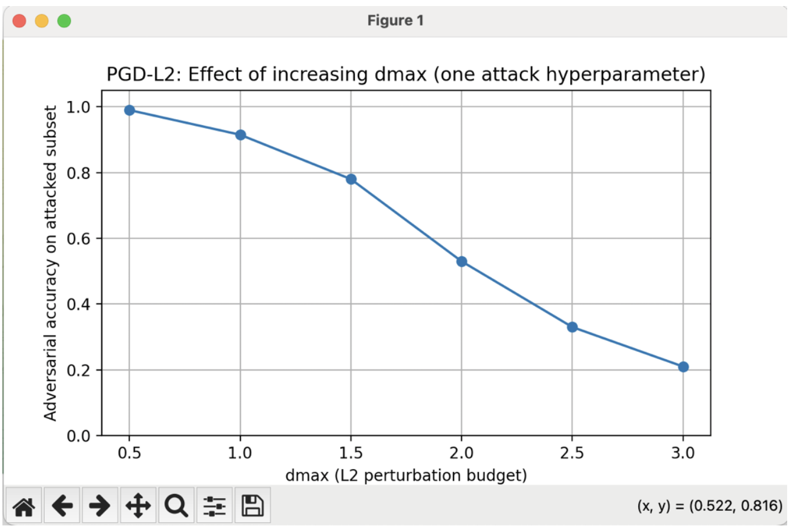

# MNIST PGD Adversarial Attack

This project investigates the robustness of a Convolutional Neural Network (CNN) trained on the MNIST handwritten digit dataset under adversarial perturbations generated using the Projected Gradient Descent (PGD) attack.

---

## Dataset

The MNIST dataset is a widely used benchmark for handwritten digit classification.

- 70,000 grayscale images of digits (28×28 pixels)
- Training samples: 60,000
- Test samples: 10,000

All images were normalized to the range **[0,1]** before training.

Dataset source:  
http://yann.lecun.com/exdb/mnist/

---

## Model

A simple Convolutional Neural Network (CNN) architecture was used for digit classification.

Architecture:

- Convolutional layer (16 filters, 5×5) + ReLU + MaxPooling  
- Convolutional layer (32 filters, 5×5) + ReLU + MaxPooling  
- Fully connected layer (128 neurons)  
- Output layer (10 classes)

Training configuration:

- Loss function: Cross-Entropy Loss  
- Optimizer: Stochastic Gradient Descent (SGD)  
- Training epochs: 3  
- Batch size: 64  

---

## Adversarial Attack

To evaluate model robustness, a **Projected Gradient Descent (PGD)** adversarial attack was implemented.

The attack generates adversarial samples by iteratively modifying the input image in the direction that maximizes the classification loss while constraining the perturbation under an **L2 norm budget**.

Only correctly classified samples from the test set were attacked in order to ensure that any misclassification was caused by the adversarial perturbation.

---

## Experiment

A small experiment was conducted to analyse how increasing the **L2 perturbation budget (dmax)** affects model robustness.

Attack configuration:

- Step size: 0.2  
- Iterations: 40  
- Variable parameter: dmax  

---

## Results

| dmax | Adversarial Accuracy | Accuracy Drop |
|-----|----------------------|---------------|
| 0.5 | 0.99 | 0.01 |
| 1.0 | 0.915 | 0.085 |
| 1.5 | 0.78 | 0.22 |
| 2.0 | 0.53 | 0.47 |
| 2.5 | 0.33 | 0.67 |
| 3.0 | 0.21 | 0.79 |

As the perturbation strength increases, adversarial accuracy decreases significantly.  
This demonstrates the vulnerability of neural networks to carefully crafted adversarial inputs.

---

## Visualization

The following plot shows how increasing the L2 perturbation budget affects adversarial accuracy.

---

## Key Insight

Even a model that performs well on clean test data can experience severe performance degradation when exposed to adversarial perturbations.

This highlights the importance of evaluating machine learning models under adversarial conditions.

---

## Author

Keerthija Bontu  
M.Eng. Information Technology (Specialization: Artificial Intelligence)
